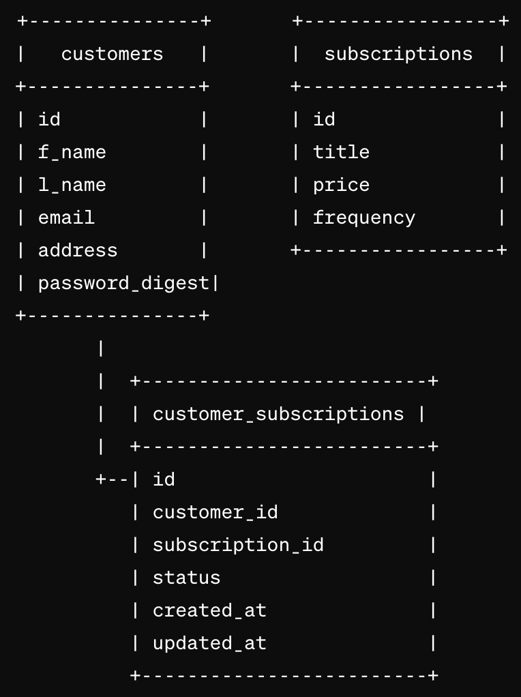

# Tea Service

## Table of Contents
- [Getting Started](#getting-started)
- [Project Description](#project-description)
- [Setup](#setup)
- [Endpoints](#endpoints)

## Getting Started
### Versions
- Ruby: 3.2.2
- Rails: 7.1.3

## Project Description

Tea Service is a Back End Rails application for a Tea Subscription Service. Customers will be able to subscribe to a tea service, cancel their subscription and see all the subscriptions (active and cancelled) they have.

This app was built to complete the BE take home challenge for MOD 4 2311, from Turing School of Software and Design.

<details>
  <summary>Setup</summary>
  1. Fork and/or Clone this Repo from GitHub.
  2. In your terminal use `$ git clone <ssh or https path>`.
  3. Change into the cloned directory using `$ cd example`.
  4. Install the gem packages using `$ bundle install`.
  5. Database Migrations can be set up by running: 
  ``` bash 
  $ rails rake db:{drop,create,migrate,seed}
  ```
</details>

<details>
  <summary>Testing</summary>

  Test using the terminal utilizing RSpec:

  ```bash
  $ bundle exec rspec spec/<follow directory path to test specific files>
  ```

  or test the whole suite with `$ bundle exec rspec`
</details>

<details>
  <summary>Database Schema</summary>
  <br>
</details>

# Endpoints
<details>
<summary>Subscribe a Customer to a Tea Subscription</summary>
Request:

```http
POST /api/v0/customers
Content-Type: application/json
Accept: application/json
```

Body:

```json
{
  "customer_identity": {
    "customer_id":2,
    "subscription_id":8
  }
}
(where 2 and 8 are valid customer and subscription IDs)
```

Response: `status: 200`
Response: `message: Subscription successfully added to Customer`
</details>

<details>
<summary>Cancel Customer Subscription</summary>
Request:

```http
DELETE /api/v0/customers/:customer_id/subscriptions/:id
Content-Type: application/json
Accept: application/json
```

Body:

```json
{
  "customer_identity": {
    "customer_id":2,
    "subscription_id":8
  }
}
(where 2 and 8 are valid customer and subscription IDs)
```

Response: `status: 204`
</details>

<details>
<summary>Get Customer's Subscriptions</summary>
Request:

```http
GET /api/v0/customers/:customer_id/subscriptions
Content-Type: application/json
Accept: application/json
```

Response: `status: 200`

```json
{
  "data": [
    {
      "id": "210",
      "type": "subscriptions",
      "attributes": {
        "title": "atlas",
        "price": 12.2,
        "frequency": "bi-weekly"
      }
    },
    {
      "id": "211",
      "type": "subscriptions",
      "attributes": {
        "title": "sturni",
        "price": 8.6,
        "frequency": "yearly"
      }
    }, "..."
  ]
}
```
</details>